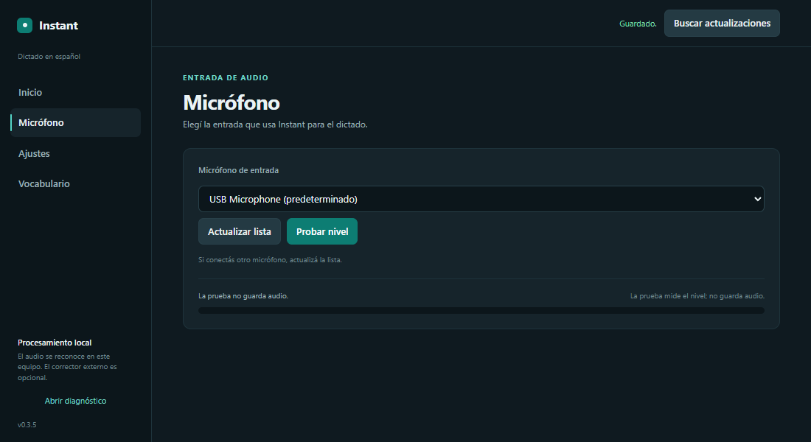
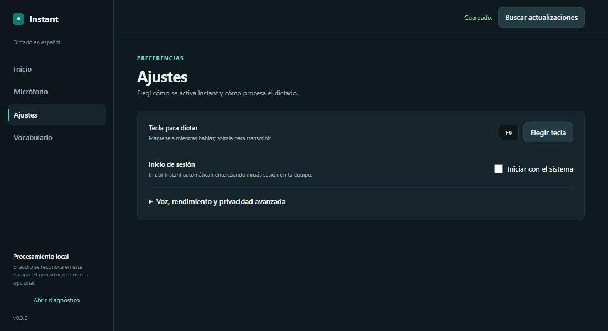
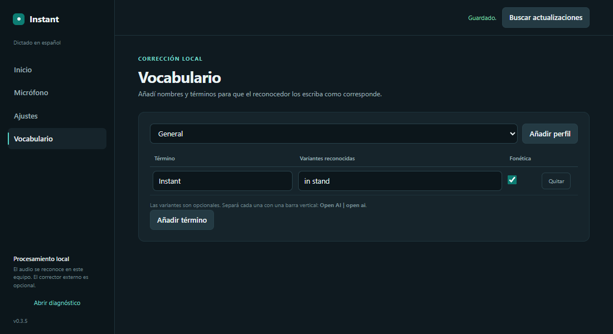

# Instant 🎙️

**Dictado por voz en español, 100 % local y privado.** Mantené F9, hablá y soltá: Instant escribe en el campo activo. Sin cuentas, sin nube, sin GPU.

[⬇️ Descargar](https://github.com/getodevel-source/Instant/releases/latest) · [📖 Guía](dictado/README.md) · [📝 Cambios](CHANGELOG.md)

  

## Por qué Instant

| | |
|---|---|
| 🔒 **Privado de verdad** | El audio nunca sale de tu equipo. Modelo local, sin telemetría. |
| ⚡ **Rápido** | Parakeet TDT v3 en CPU: tu voz a texto en una fracción de segundo. |
| 🎯 **Preciso en español** | Diccionario técnico, corrección fonética y restauración de `¿?` incluidos. |
| 🪶 **Liviano** | Sin GPU, ~670 MB de modelo que se descarga una sola vez. |

## Empezar en 1 minuto

1. Descargá la versión para tu sistema desde [Releases](https://github.com/getodevel-source/Instant/releases/latest).
2. Abrí Instant, elegí el micrófono y configurá la tecla.
3. Enfocá cualquier campo de texto, mantené la tecla mientras hablás y soltala al terminar. Listo.

| Sistema | Descarga |
|---|---|
| Windows | `Instant-Setup.exe` (instalador) o `Instant.exe` (portable) |
| Linux (X11) | `instant-linux` |
| macOS | `instant-macos` |

## Pantallas

<table>
  <tr>
    <th>Micr&oacute;fono</th>
    <th>Ajustes</th>
  </tr>
  <tr>
    <td></td>
    <td></td>
  </tr>
  <tr>
    <th>Vocabulario</th>
    <th>Indicador de voz</th>
  </tr>
  <tr>
    <td></td>
    <td valign="middle" align="center"></td>
  </tr>
</table>

## Privacidad y actualizaciones

El audio no se envía a la nube. Si activás el pulido opcional, el servidor que elijas recibe el texto reconocido y el vocabulario activo, nunca el audio. Instant verifica cada actualización y espera tu confirmación antes de instalarla.

## Más información

[Instalación y uso detallados](dictado/README.md) · [Precisión y motores](docs/precision.md) · [Historial de versiones](CHANGELOG.md) · [Licencia MIT](LICENSE)
