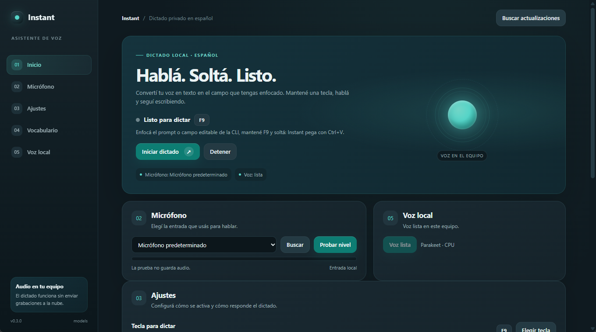
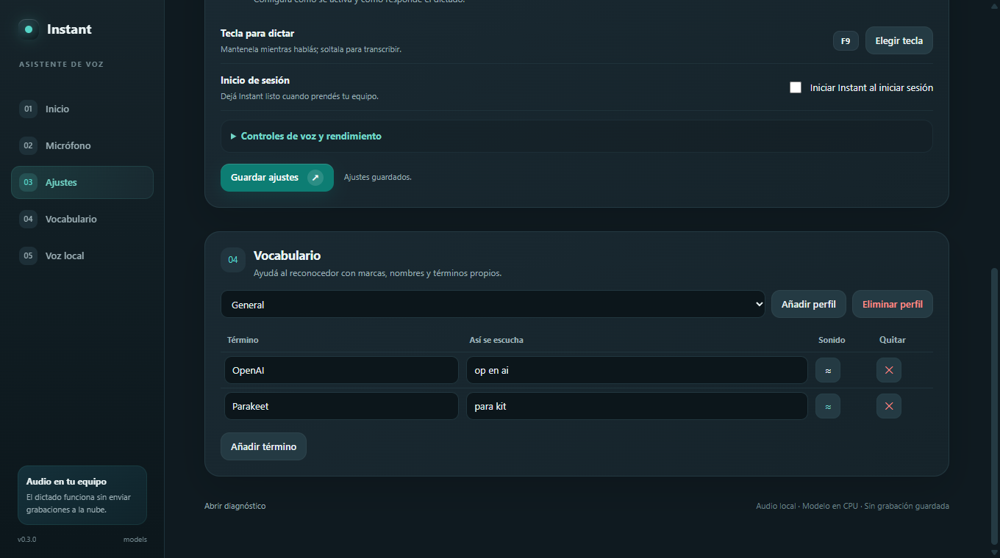

# Instant

Dictado por voz local en español: mantené F9, hablá y soltá. Instant transcribe y pega el texto en el campo enfocado. El reconocimiento corre en CPU; el audio no se envía a la nube.



*Inicio, micrófono, ajustes, vocabulario y voz local en una interfaz con navegación lateral.*

## Instalación

### Windows (recomendado)

Descargá `Instant-Setup.exe` de la [última release](https://github.com/getodevel-source/Instant/releases/latest) y ejecutalo: instala **por usuario, sin pedir administrador**, con acceso directo, desinstalador propio (Aparece en «Aplicaciones instaladas») y la opción de arrancar con Windows. El arranque es de ~0,2 s (el instalador usa la variante en carpeta, no el onefile). La primera vez, Windows SmartScreen avisa porque el ejecutable todavía no está firmado; no es indicio de un binario alterado.

También hay un `Instant.exe` **portable** (un solo archivo, sin instalar ni desinstalador) en la misma release, para probar o usar desde un pendrive.

### Linux (X11) / macOS

Descargá el binario de tu sistema de la última release (`instant-linux` / `instant-macos`), o instalá desde el repo con Python 3.12+:

```bash
chmod +x instant-linux          # o instant-macos
./instant-linux setup           # panel: modelos, micrófono y tecla
./instant-linux run             # daemon hold-to-talk
```

En Linux, `install.sh` desde el checkout instala además las libs del sistema que el panel necesita (`libxcb-cursor0`, GL, xkbcommon) cuando puede.

### Desde el repo (desarrollo)

```bat
git clone https://github.com/getodevel-source/Instant.git
cd Instant
install.bat          :: Windows
```
```bash
./install.sh         # Linux / macOS
```

La primera configuración abre el mismo panel en los tres sistemas (UI web sobre
QtWebEngine): descarga Parakeet TDT v3 int8 (~670 MB) y Silero VAD (~1 MB) —con progreso en MB, reanudable si se corta y espejo configurable con `HF_ENDPOINT`— y permite elegir micrófono y tecla. Para configurar sin ventana (servidores, SSH): `instant setup --tui`. El pegado requiere X11 en Linux; macOS puede pedir permisos de micrófono y accesibilidad.

Para instalaciones automatizadas, `INSTANT_UNATTENDED=1` ejecuta la configuración sin preguntas. `INSTANT_AUTOSTART=1` activa además el arranque con el sistema.

## Uso

En Windows:

```bat
instant-run.bat
instant-setup.bat
instant-status.bat
instant-stop.bat
```

Sin argumentos, `instant-setup.bat` abre la ventana de ajustes sin
dejar una consola abierta y **no** inicia el daemon: usa `dist/Instant.exe setup`
si el ejecutable está disponible, o `pythonw` en segundo plano. Los argumentos
explícitos conservan su salida de CLI en consola.

El panel agrupa **Inicio**, **Micrófono**, **Ajustes**, **Vocabulario** y
**Voz local** en una navegación lateral. Desde ahí podés revisar el estado,
probar el nivel sin guardar audio, elegir la tecla y el arranque con el sistema,
ajustar el estilo y el rendimiento del overlay, y editar vocabularios por
perfil. Cada término admite variantes (`a | b | c`), corrección por sonido
(`≈`) y eliminación (`✕`).



`instant` sin argumentos abre el panel (en Windows, `dist/Instant.exe`) y se
asegura de que haya un solo daemon activo; una segunda apertura enfoca la
ventana existente en vez de duplicarla. `instant setup` es solo configuración
(en Windows, `Instant.exe setup`). En Windows, cerrar la ventana con X deja el
icono y el servicio en la bandeja; «Salir de Instant» desde el menú de la
bandeja cierra ambos. En Linux/macOS el daemon sigue vivo hasta
`instant-stop.sh` (todavía sin icono de bandeja).

Antes de mantener F9, enfocá el prompt o campo editable de la CLI; Instant copia
el resultado y envía Ctrl+V al campo enfocado. El overlay del daemon dibuja en
web (QtWebEngine) en los tres sistemas — Tk queda de respaldo automático —,
no muestra el contenido dictado y confirma «Copiado». Windows
puede ubicar el icono bajo la flecha de iconos ocultos.

Mientras dictás, el orbe respira con tu voz (nivel y espectro reales del
micrófono); al soltar, un arco barre mientras transcribe y el tilde confirma.
Vive fijo abajo al centro del monitor donde trabajás:


## Actualizaciones

Cada release de GitHub (`v*`) trae el instalador de Windows (`Instant-Setup.exe`), el portable (`Instant.exe`) y el binario de cada sistema, siempre con su `.sha256`. La app se actualiza según cómo esté instalada:

- **Instalada con el instalador (Windows):** al detectar una versión nueva, la app descarga `Instant-Setup.exe` en segundo plano y verifica su SHA256. Cuando está listo, podés elegir «Actualizar y reiniciar»; Instant frena el dictado, corre el instalador silencioso (in-place, sin admin) y se reabre actualizado.
- **Portable (Windows):** después de descargar y verificar `Instant.exe`, elegí aplicar; el helper incluido con el ejecutable frena todo, respalda el exe anterior (`Instant.exe.bak`) y lo cambia. Si el daemon nuevo no levanta, restaura el `.bak` y reabre la ventana. Los portables publicados antes de incluir el helper pueden necesitar reemplazar manualmente su primer exe nuevo.
- **Linux/macOS:** el binario se reemplaza en caliente (el proceso vivo sigue con el viejo hasta reiniciar). Desde el panel o con `instant update --download DIR --apply`. `instant stop` frena el daemon cuando haga falta.

Sin `.sha256` no se instala nada: la descarga se verifica antes de aplicar.

```bat
instant update              :: dice si hay versión nueva
instant update --download DIR
instant update --download DIR --apply   :: Linux/macOS: baja y reemplaza
instant-update.bat <archivo descargado> <sha256> [exe destino] :: repo/recuperación portable
```

La ventana consulta sola una vez por día. Si encuentra una versión nueva,
descarga el paquete verificado y muestra el progreso; la instalación empieza
solo cuando elegís «Actualizar y reiniciar». Si falla la descarga, podés
reintentar desde el aviso o el panel. Una copia abierta desde el repositorio
indica que se actualiza con `git pull`.

## Privacidad y datos

- El audio se procesa localmente con Silero VAD y Parakeet; no se sube a un servicio.
- Instant no guarda el texto reconocido en su log de sesión; registra duración,
  estado y errores para el diagnóstico.
- Si definís `DICTADO_SAVE_WAVS`, guarda localmente hasta 50 audios de sesiones
  que terminaron sin texto reconocido, junto con metadatos de duración y nivel.
- Los modelos se descargan durante la configuración y se guardan en `models/`, que no se versiona.
- El pulido LLM está apagado por defecto. Al configurarlo, Instant envía solo el
  texto transcrito y el vocabulario activo al endpoint elegido (nunca el audio);
  si ese endpoint está fuera de tu equipo, usá HTTPS porque el servidor recibirá
  ambos.

## Desarrollo

El paquete está en `dictado/`; la guía detallada de configuración y CLI está en [`dictado/README.md`](dictado/README.md).

Toda la suite, desde `dictado/`:

```bash
python -m unittest discover -s tests
```

También se puede correr archivo por archivo. Los que usan Qt informan `SKIP` si PySide6 no está instalado; en CI la suite corre con Qt en Windows, Linux y macOS:

```bash
python dictado/tests/test_regression.py     # overlay, setup, audio y contextos
python dictado/tests/test_context.py        # perfiles de vocabulario y pulido LLM
python dictado/tests/test_models_download.py # descarga: progreso, reanudación, disco
python dictado/tests/test_overlay_selection.py # web primero, Tk de respaldo
python dictado/tests/test_daemon_overlay.py # progreso por sesion y feedback
python dictado/tests/test_datadir.py        # precedencia de DICTADO_DATA
python dictado/tests/test_autostart.py
python dictado/tests/test_app_lifecycle.py  # daemon unico y arranque del panel
python dictado/tests/test_single_instance.py # canal del panel (instancia única)
python dictado/tests/test_update.py         # modos de instalación y sidecar SHA256
python dictado/tests/test_tray.py
python dictado/tests/test_gui_settings.py
python dictado/tests/test_gui_lifecycle.py
python dictado/tests/test_panel_page.py      # contrato del panel y QWebChannel
python dictado/tests/test_config.py           # guardado atómico de preferencias
python dictado/tests/test_deps.py             # mínimo de Python y diagnóstico
python dictado/tests/test_privacy_logs.py     # logs sin texto dictado
```

La decisión de motor (por qué Parakeet y qué se descartó) está en
[`docs/motores.md`](docs/motores.md).

El panel de control es la misma ventana web (QtWebEngine) en los tres
sistemas; en Linux/macOS el canal de instancia única es `QLocalServer` (en
Windows, mutex + `FindWindow`). El icono de bandeja (Windows) y el overlay web
del daemon son superficies independientes. El workflow de tags `v*`
publica tres cosas por release: el instalador de Windows (`Inno Setup`, sobre
la variante onedir), el `Instant.exe` portable y los binarios de Linux/macOS
(con Qt, QML y Pillow incluidos). Windows usa hooks selectivos de Qt, sin
`--collect-all PySide6`: el build local de PyInstaller 6.22.3 pasó de
303.651.236 a 96.099.689 bytes (reducción del 68,4 %); el instalador comprime
la carpeta onedir (218 MB en disco) a ~57 MB.

Los cambios por versión están en [`CHANGELOG.md`](CHANGELOG.md), incluidas las
limitaciones conocidas.

## Desinstalar

Instalación con `Instant-Setup.exe`: desinstalá desde **Aplicaciones instaladas** (o el grupo de Instant en el menú Inicio). El desinstalador frena el dictado, borra la app y **no** toca tu configuración ni los modelos: para eso seguí con el punto 4 de abajo.

Instalación desde el repo o portable:

1. Desactivá el arranque con el sistema: `instant setup --no-autostart` (o la casilla del panel).
2. Frená el dictado: `instant stop` (`instant-stop.bat` / `./instant-stop.sh`).
3. Borrá la carpeta del repositorio (o del portable), que incluye `.venv` y `models/`.
4. Si querés borrar también tus datos y configuración:
   - Windows: `%APPDATA%\instant` (config y log) y `%LOCALAPPDATA%\instant` (modelos).
   - Linux: `~/.config/instant` y `~/.local/share/instant`.
   - macOS: `~/Library/Application Support/instant`.

Nada se escribe fuera de esas carpetas.

## Licencia

MIT. Ver [`LICENSE`](LICENSE).

Los ejecutables todavía no están firmados, así que Windows SmartScreen avisa la
primera vez que se abren. Es esperable hasta que haya un certificado de firma de
código; no es un indicio de que el binario esté alterado.
