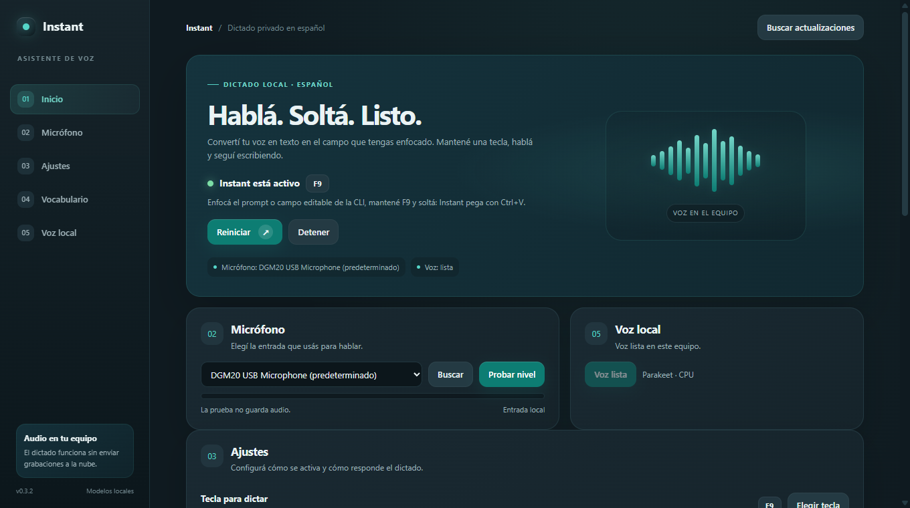

# Instant

**Dictado por voz en español, local y simple.** Mantené F9, hablá y soltá: Instant pega el texto donde estás escribiendo.

[Descargar la última versión](https://github.com/getodevel-source/Instant/releases/latest) | [Guía completa](dictado/README.md) | [Cambios](CHANGELOG.md)

## Empezar

1. Descargá el archivo para tu sistema desde [Releases](https://github.com/getodevel-source/Instant/releases/latest).
2. Abrí Instant y elegí el micrófono y la tecla para dictar. La primera vez descarga el modelo local (unos 670 MB).
3. Mantené la tecla, hablá y soltala.

| Sistema | Descarga |
| --- | --- |
| Windows | `Instant-Setup.exe` o versión portable `Instant.exe` |
| Linux (X11) | `instant-linux` |
| macOS | `instant-macos` |

El reconocimiento corre en CPU. El audio se procesa en tu equipo y no se envía a la nube.

## Privacidad y actualizaciones

El pulido opcional puede enviar el texto transcrito y el vocabulario activo al servidor que configures; nunca envía el audio. Las versiones instaladas buscan actualizaciones, descargan el paquete verificado y esperan tu confirmación para aplicarlo.

## Más información

[Instalación y uso detallados](dictado/README.md) | [Historial de versiones](CHANGELOG.md) | [Licencia MIT](LICENSE)
